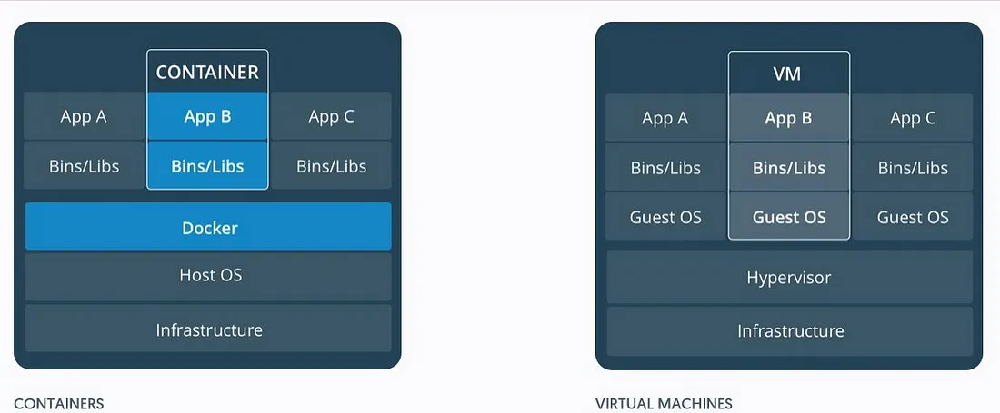
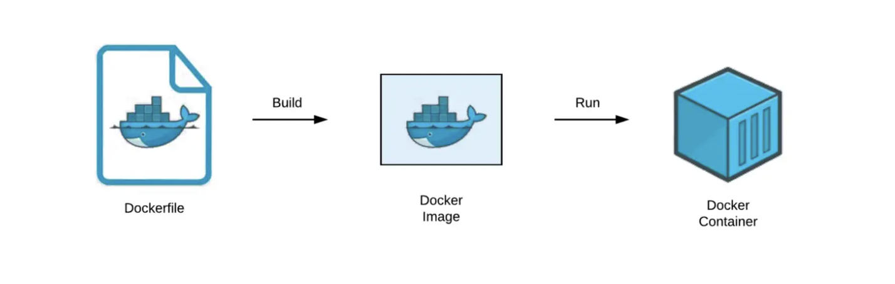
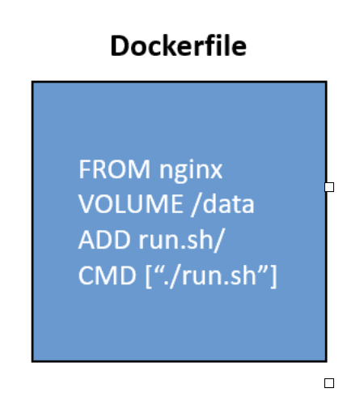
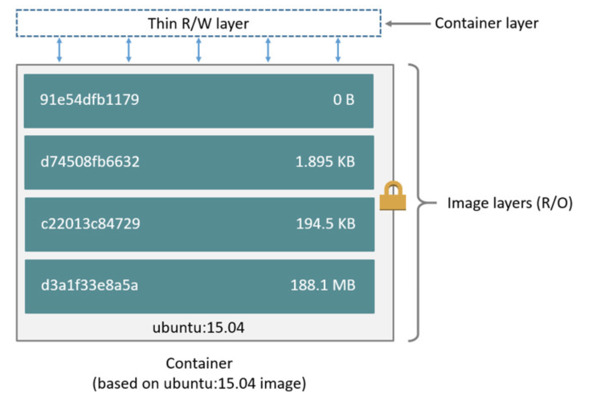
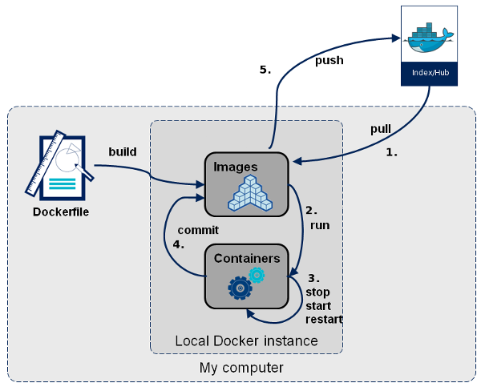
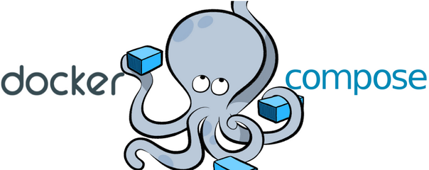

# 認識 Docker 前，必須先了解何謂虛擬化
白話來說虛擬化要解決的問題就是：
「我寫好了一支程式，在我的電腦上可以跑，但搬到你的電腦上卻出錯」。

目前常見的虛擬技術有兩種，一種是以處理作業系統為單位的虛擬化技術，我們將它稱之為虛擬機（Virtual Machine)，著名的代表有 VMware； 另一種是以 APP 為單位的虛擬化技術，我們將它稱為容器化（Containerize），著名的代表有 Docker Container。

<br>
<br>

# 關於 Docker


- 構想理念是「Build and Ship any Application Anywhere」

- Containers as a Service ( CaaS ) - 容器如同服務

- Docker 是一種軟體平台，可讓您快速地建立、測試和部署應用程式。
- Docker 將軟體封裝到名為容器的標準化單位，其中包含程式庫、系統工具、程式碼和執行時間等執行軟體所需的所有項目。
- 讓使用者只需專注於應用程式的開發，為他們省下建置環境的時間與精力。


**為什麼要使用 Docker**
- 更有效率的利用資源 （相較於虛擬機）
- 主機上快速部署 （只要安裝 docekr）
- 統一環境 (環境因為語言或套件版本等等,無法運行)
- 更有效率的 CI/CD 流程(docker hub)

<br>
<br>


# 虛擬機（VM）和 容器化（Containerize）

### 虛擬機（VM）
VM 是一種體積龐大且耗能高的軟體套件。VM 會模擬底層的主機資源（CPU、RAM、Storage），將資源分配給上層的應用程式使用。

### 容器化（Containerize）
容器化是一種在概念上相似於虛擬機，但在原理上略有不同的技術，其主要目的在於提供開發者用於測試應用程式的沙盒環境。開發者能夠在容器內配置不同的資源，因為每個容器都獨立運行且彼此之間不會互相影響。


* Container是以應用程式為單位，而VM是以作業系統為單位。
* Container依賴Host OS的核心(kernel)來運行Container，因此Windows的Container必須在Windows OS上運行；Linux的Container必須在Linux-base OS上運行。而VM則可以隨意選擇。
* Container是一個封裝了相依性資源與應用程式的執行環境；VM則是一個配置好CPU、RAM與Storage的作業系統。
* Container間是彼此隔離的，因此在同一台機器我們可以執行不同的版本的服務，但是VM則會因版本不同造成環境的衝突。
* Container因為是以程式為單位，需要的硬體資源更少，VM則會先佔用CPU、RAM等等硬體資源，不管有沒有要用都會先佔用。
* VM使用較大型的服務、而Container多使用於微服務中。

| 功能           | Virtual Machine     | Docker Container   |
| -------------- | ------------------- | ------------------ |
| 虛擬化的目標   | 作業系統            | 應用系統           |
| 啟動時間       | 久（幾分鐘）        | 短（幾秒）         |
| 容量           | GB                  | MB                |
| 耗費資源       | 較多                | 較少              |
| 複製相同環境   | 慢                  | 快                |
| 服務內容       | 大型專案服務        | 多使用於微服務中   |




從這張圖可以看出 Containers 並沒有 OS ，容量自然就小，而且啟動速度快
詳細可參考 https://www.docker.com/what-container

<br>
<br>

# Docker 安裝

[官方文件](<https://docs.docker.com/get-docker/>)

### Windows (底層是透過 Hyper-V 來乘載 Docker Engine)
Docker Windows 的所需條件，自然就是Windows 10 ，且必須為Build 10586 以上版本， 而且必須啟用Hyper-V 和容器功能

[安裝教學與常見錯誤](<https://www.c-sharpcorner.com/article/how-to-install-docker-desktop-and-troubleshoot-issues-in-windows-machine/>)
[WSL 錯誤處理](<https://learn.microsoft.com/zh-tw/windows/wsl/install-manual>)

### Linux (Ubuntu)
[安裝教學與設定](< https://docs.docker.com/engine/install/ubuntu/>)

<br>
<br>

# Docker 基本觀念
Docker 三元素 Image、 Container、 Registry
## 0. Docker 的運作流程
透過 Dockerfile 或 docker hub 拉取的 image 啟動成容器服務


## 1. Image 映像檔
Docker Image 像是一個模板，用來重複產生容器實體。Image 是個唯讀（ R\O ），可以把它想成是以再使用 VM 的 Guest OS（ 安裝在虛擬機上的作業系統 ）或是安裝軟體的一個光碟片。
例如：一個映像檔裡可以包含一個完整的 MySQL 服務、一個 Python 的編譯環境、或是一個 Ubuntu 作業系統。

### 如何取的 Image？
* 從 DockerHub 下載
* 自己寫 DockerFile

#### Dockerfile
```
# 切至 DockerFile 目錄
docker build . -t <images_name>:<tag>
# 生成 image
```


<br>

## 2. Container 容器

利用映像檔（ Image ）所創造出來的，一個 Image 可以創造出多個不同的 Container，Container 也可以被啟動、開始、停止、刪除，並且互相分離。

可以把容器看做是一個執行的應用程式加上執行它的簡易版 Linux 環境（包括 root 使用者權限、程式空間、使用者空間和網路空間等）。

另外要注意的是，Docker 映像檔是唯讀（read-only）的，而容器在啟動的時候會建立一層可以被修改的可寫層作為最上層，讓容器的功能可以再擴充。




## 3. Registry

可以把它想成類似 GitHub，裡面存放了非常多的 Image ，而 Docker 倉庫註冊伺服器的概念就跟 Github 類似，你可以在上面建立多個倉庫，然後透過 push、pull 的方式上傳、存取。



<br>
<br>

# Docker 常用指令
```
# 版本
docker -v
```
### image
```
# 列出本地映像
docker image ls
docker images

# 從 Docker Hub 下載
docker pull IMAGE_NAME[:TAG]

# 刪除本地
docker rmi IMAGE_ID

# 移除無應用在容器的
docker image prune -a

# 映像的詳細資訊
docker image inspect IMAGE_ID

# dockerfile build images
docker build -t <image_name>:<tag> .
# ex 映像名 my-app，版本（標籤） 1.0 ;無輸入 tag, latest 為預設標籤。
docker build -t my--app:1.0 .

# 避免 Build 時被cache 住，而造成沒有build 到修改過的Dockerfile
docker build --no-cache -t <image-name>

# 查詢 image 的每一層
docker history [OPTIONS] IMAGE

```
### containers

```
# 顯示全部容器
docker ps -a

# 顯示運行中的容器
docker ps

# 新增不啟用
docker create --name <container_name> <image_name>

# 新增並啟用容器
docker run [OPTIONS] IMAGE[:TAG|@DIGEST] [COMMAND] [ARG...]
docker run -it --name <container_name> <image_name>

# -name : 容器 name
# -d　　:　detach，背景執行
# -it　:　跟容器互動
# -rm　:　當容器終止時會自動刪除
# --restart=always : 自動重啟（host開機時 容器當機
# -p　: port,左 host 右 container
# -v　:  Volume 對映,左 host 右 container
# -e ： 設定環境變數(AAA=BBB)

# Port
docker run --restart=always -d -it -p 80:80 ubuntu:18.04

# Volume
# Volume（卷）是用於在 Docker 容器和主機之間持久化存儲數據的機制。
docker run --restart=always -d -it -p 80:80 -v ~/www:/var/www/html ubuntu:18.04

# 再啟
docker start <container_name>

# 停止
docker stop <CONTAINER_NAME>

# 停止 全部運行的 Container
docker container stop $(docker ps -q)

# 删除所有停止运行的容器：
docker rm $(docker ps -a -q)

# 移除 全部的
docker container prune

# 移除 指定的
docker rm <container_name>
# -f : 代表 force 強制

--

# 進入容器 cmd
docker exec -it <container_name> bash
docker attach <container_name>    # 退出停止容器
docker exec -u 0 -it <container_name> bash # 最大權限
docker exec -it <container_name> /bin/sh  # Alpine 無bash

--

# 容器 log
docker logs -f <container_name>
docker logs -n 50 1bb754f96eee

# 存 log 檔案
docker logs <container_name> >> access.log

# 鍵字搜尋 | grep keyword >  tmp.log 。存 log。
docker logs <container_name>  | grep "29/Mar/2022" >> tmp.log

# -f:持續更新log
# -t:顯示時間
# -n:筆數
--

# 容器資訊
docker inspect image name

# 複製檔案進去容器
docker cp dump.sql <container_name>:/tmp/dump.sql

# 從容器複製檔案出來
docker cp <container_id>:/path/to/container/file /path/on/host

# ex 是從名為 docker-elk-elasticsearch-1 的容器中複製位於 /usr/share/elasticsearch/cert.zip 的檔案到本地主機的 /home/ian 目錄
docker cp docker-elk-elasticsearch-1:/usr/share/elasticsearch/cert.zip /home/ian
```

### Dockerfile
```
FROM: 指定基礎映像，基礎映像:標籤 應替換為實際的基礎映像和標籤。

MAINTAINER: 提供維護者信息。

RUN: 執行 Linux 命令，例如安裝軟體包、更新系統等。

ADD: 將本地文件或目錄複製到容器中。路徑 /容器內路徑 是容器內的目標路徑。

COPY: 類似於 ADD，但只能複製本地文件，不能複製目錄。也將文件複製到容器中。

WORKDIR: 設置工作目錄，後續的指令都會在這個目錄下執行。

ENV: 設置環境變數，可以在後續的指令中使用。

ENTRYPOINT: 定義容器啟動時執行的命令。使用 JSON 陣列形式來指定可執行文件和參數，例如 ["可執行檔", "參數1", "參數2"]。

CMD: 提供默認的執行命令，可以被覆蓋。也使用 JSON 陣列形式，例如 ["可執行檔", "參數1", "參數2"]。

```
---
<br>
<br>

## 範例

### 範例, Hello word
https://hub.docker.com/_/hello-world
```
$ docker run hello-world

Hello from Docker!
This message shows that your installation appears to be working correctly........
```

### 範例 0, 建立 docker image 並起 Container
#### 從 docker hub 取得 並起容器(linux nginx)
```
# 等於 docker pull image and run
docker run --restart=always -d -it -p 80:80 -v ~/www:/var/www/html hao66bmbm/test2022
```
<br>

### 範例 1, 自己編撰,無到有 Run Python (demo_01 資料夾)
1. 建立 Dockerfile
    ```
    # 使用
    FROM python:3.8.3-alpine3.12
    # 當前目錄 映射 到容器内 /app目錄
    ADD . /app
    # 設置 /app為工作目錄
    WORKDIR /app
    # 啟用
    CMD python main.py
    ```
2. 建立 main.py
    ```
    print('hello')
    ```
3. 準備好上面2個檔案, 開始 docker build and run
    ```
    # 建立 image (當前目錄 Dockerfile 構建一個名為 python_image)
    docker build -t python_image .

    # 起容器
    # 運行一個名為 python_test_231219 容器，使用 python_image 映像。
    docker run -it --name python_test_231219 python_image
    ```

### 範例 2, 起一個網頁服務 (見 demo_02 資料夾)

---

<br/>
<br/>

#  docker-compose
可參考官網 https://docs.docker.com/compose/
Compose 是定義和執行多 Container 管理的工具

實務上當我們建立一個網頁服務時，通常需要整合多個服務來協同工作，包括網頁框架（Web Framework）、數據庫（Database），以及網頁伺服器，例如 Nginx 或 IIS。

在使用 Docker 的情境下，我們可以透過 Docker Compose 管理這些服務。上述範例中，我們提到的三個服務（網頁框架、數據庫、Nginx）可以透過一個簡單的 docker-compose.yml 文件配置，並透過 docker-compose up 命令一次性啟動這三個容器，彼此之間建立連接，形成一個完整的網頁應用程式環境。




<br>

## yml 的編寫 範例
```
version: '3'  # 指定 Docker Compose 的版本

services:
  web:
    container_name: my-web-app  # 指定容器名稱
    image: your-web-app-image:latest  # 使用特定版本的映像檔
    ports:
      - "80:8000"  # 將主機的 80 埠映射到容器的 8000 埠
    depends_on:
      - db  # 指定此服務依賴的服務，確保 db 先啟動
      - nginx  # 指定此服務依賴的 nginx
    environment:
      - APP_ENV=production  # 設定環境變數
      - APP_DEBUG=false
    volumes:
      - ./web:/var/www/html  # 映射本地目錄到容器內

  db:
    container_name: my-database  # 指定容器名稱
    image: your-db-image:latest  # 使用特定版本的映像檔
    environment:
      POSTGRES_DB: yourdatabase  # 設定 Postgres 的資料庫名稱
      POSTGRES_USER: youruser  # 設定 Postgres 的使用者名稱
      POSTGRES_PASSWORD: yourpassword  # 設定 Postgres 的使用者密碼
    volumes:
      - db_data:/var/lib/postgresql/data  # 持久化數據存儲

  nginx:
    container_name: my-nginx  # 指定容器名稱
    image: nginx:latest  # 使用最新的 Nginx 映像檔
    ports:
      - "80:80"  # 將主機的 80 埠映射到容器的 80 埠
    volumes:
      - ./nginx/conf:/etc/nginx/conf.d  # 映射本地 Nginx 配置檔到容器
    depends_on:
      - web  # 確保 web 服務啟動後才啟動 nginx

volumes:
  db_data:  # 定義命名卷來保存數據，以防止數據隨容器刪除而丟失

```


### 相關指令
```
# 版本
docker-compose --version

# 啟動
docker-compose up

# 重新編譯啟動
docker-compose up --build

# 重新編譯啟動+背景
docker-compose up -d --build

# 起 3 個相同的服務
docker-compose up --scale web=3

--

# 停止
docker-compose stop

# 停止+消除 容器 網路
docker-compose down

# 停止+消除 容器 網路 鏡像
docker-compose down --rmi all

--

# 狀態
docker-compose ps

# 執行容器 並使用 命令（top）
docker-compose run myweb top

# 輸出日誌
docker-compose logs -f myweb
docker logs -f work_myweb_1

# 指定使用特定的 yml(檔案名稱)
docker-compose -f filebeat-compose.yml up -d

# 進入 web 這個 service 的 bash
docker-compose exec web bash

```
.yml 文件 版本對應
https://docs.docker.com/compose/compose-file/compose-versioning/


## 範例
* 範例 1, demo_02 改寫成 compose
* 範例 2, demo_03 使用 compose 管理 2 個容器
* 範例 3, 使用官方教學 C# .NET 6.0 + postgres  無到有(demo_04)
https://docs.docker.com/language/dotnet/containerize/
* 範例 4, 自建 .NET 8.0 Web API + postgres + DocFX
<br>


# 其他參考

* [Docker 基本觀念介紹](<https://philipzheng.gitbook.io/docker_practice/>)

* [基礎教學（ Node.js 的 Web App）](<https://chengweihu.com/docker-tutorial/>)

* [ Docker 的預設網路設置](<https://mileslin.github.io/2019/05/%E7%9E%AD%E8%A7%A3-Docker-%E7%9A%84%E9%A0%90%E8%A8%AD%E7%B6%B2%E8%B7%AF%E8%A8%AD%E7%BD%AE/index.html>)

* [各語言 Docker 範例](<https://docs.docker.com/language/>)

* [Windows WSL2 Docker 存放空間更改](<https://stevenjhu.com/2020/11/14/docker-docker-for-windows%E8%99%9B%E6%93%AC%E7%A3%81%E7%A2%9F%E5%AD%98%E6%94%BE%E4%BD%8D%E7%BD%AE%E7%A7%BB%E5%8B%95%E6%AD%A5%E9%A9%9F/>)

* [Windows WSL2 Docker 空間釋放](<https://gist.github.com/banyudu/af131c7bb681e8a80b5cbe2047e62d4c>)

* [進入未運行或無法啟動的容器](<https://blog.csdn.net/comeonyangzi/article/details/132556828>)

* [Docker 可以快速啟用哪些服務](<https://hackmd.io/@haobmbm/docker>)


* [Windows WSL2 Docker 使用效能調整](<https://blog.csdn.net/qq_35617030/article/details/136388601?utm_medium=distribute.pc_relevant.none-task-blog-2~default~baidujs_baidulandingword~default-0-136388601-blog-123316551.235^v43^pc_blog_bottom_relevance_base8&spm=1001.2101.3001.4242.1&utm_relevant_index=1>)