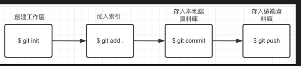
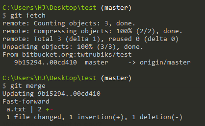
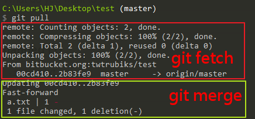

# Git 基本使用
###### tags: `Git` `義联`

## Git 介紹
Git 是一種分散式版本的版本控制系統，用於追蹤和管理檔案、軟體代碼的變更。它允許多個開發者協同合作，在同一個項目中進行代碼的編寫、修改和管理，同時跟蹤每個變更的歷史記錄。

官方下載 https://git-scm.com/download/win

---

<br>

### Git = GitHub ? GitLab = GitHub = Bitbucket?
**一個是工具，一個是網站**

* Git 是一款版本控制軟體
* GitHub 、 GitLab 、Bitbucket 都是基於 Git 版本控制系統的代碼托管平台，是一個商業網站本體是一個 Git 伺服器

---

<br>

## 開始使用 Git 基本設定

安裝完 Git 之後，第一件事情就是去設定自己的名字和信箱
```
# 全局
git config --global user.name "Your Name"
git config --global user.email

# 單專案
git config user.name "Your Name"
git config user.email "youremail@example.com"

# 確認是否成功
git config --global user.name
git config --global user.email
```
### 基本流程
1. 初始化這個目錄進行版控
    ```
    git init
    ```
2. 檢視工作區狀態 (任何變動都會記錄)
    ```
    git status
    ```
3. 提交檔案
    ```
    git add file
    ```
4. 這次的 Commit 做了什麼事
    ```
    git commit -m "init commit"
    ```

5. 檢視紀錄
    ```
    git log
    ```
----

<br>

## 狀況參考
### LOG 其他的檢視方式 與 使用
```
git log --graph --pretty=format:"%Cred%h%Creset -%C(yellow)%d%Creset %s %Cgreen(%cr) %C(bold blue)<%an>%Creset" --abbrev-commit --date=relative
git log --pretty=oneline
git log --oneline --graph

# 找特定人的 commit
git log --oneline --author="name"
# 找特定訊息的 commit
git log --oneline --grep="名片"
git log -S "名片"

# 檔案修改紀錄
git log -p filename

# 行數的紀錄
git blame -L 5,10 file
```
---

### 修改 commit (如果已經push出去就不要改)
##### 最新的 commit 修改文字

```
git commit --amend -m "testtest"
```
##### 最新的 commit 增加檔案
```
git add filename
git commit --amend --no-edit
```

##### 建議
* 直接用 git reset 刪除 commit,重新來commit
* (進階)使用 rebase 功能

---
### 不想被紀錄的檔案(key、.env、.vscode、log等等)
新增
```
touch .gitignore
```
.gitignore

```
# Environments
.env
.venv
env/
venv/
ENV/
env.bak/
venv.bak/

# 忽略所有 db 目錄下附檔名是 .sqlite3 的檔案
/db/*.sqlite3

# 忽略所有附檔名是 .tmp 的檔案
*.tmp

```

----

### 放棄修改
```
git checkout .
git checkout filename
```
```
# 已經加入暫存
git restore --staged .
```

----

### 還原

```
git reset --hard 板號
git reset --soft 板號
git reset --mixed 板號 (預設)
```

--hard 之前的 commit 都丟掉，工作區不保留，全部還原。
--mixed 之前的 commit 都丟掉，不保留工作區的狀態。
--soft 之前的 commit 都丟掉，保留工作區的狀態。(推薦)

```
# 想還原 被還原之前的板號
git log -g
git reflog
```

```
# 直接從分支還原
git reset --hard master
```

---

<br>

## 分支
```
# 目前的分支
git branch

# 更新目前分支名稱
git branch -M main

# 新增分支
git branch dev
# 切換
git checkout dev
# 以上兩行指令，相當於下列一行指令
git checkout -b dev

# 刪除
git branch -d dev
# 強制刪除(使用原因 分支修改沒被處理
git branch -D dev

```
<br>

### 為什麼要使用分支

多人協作時候，可能就不能這麼隨興的想 Commit 就 Commit


**Git flow(視團隊之需要)**


#### Git Flow 的主要特點包括：

分支策略： Git Flow 定義了幾個主要的分支，包括 master 分支、develop 分支、feature 分支、release 分支和 hotfix 分支。每個分支有不同的用途和生命週期。

* master ： 這是主要的生產分支，用於存放穩定的、已經發佈的代碼。只有測試通過的代碼才會合併到 master 分支。

* develop ： 這是開發的主要分支，包含最新的功能和修復。開發團隊在這個分支上進行日常的開發工作。

* feature ： 用於開發新功能。每個功能都在一個獨立的 feature 分支上進行開發，開發完成後合併回 develop 分支。

* release ： 用於準備發佈新版本。在這個分支上進行最後的測試、修復問題，然後合併回 master 和 develop 分支。

* hotfix ： 用於修復已經發佈的版本中的嚴重問題。開發者可以從 master 分支創建 hotfix 分支，修復問題後合併回 master 和 develop 分支。

Git Flow 提供了一個清晰的分支結構和流程，有助於減少混亂、衝突和錯誤，

<br>

### 分支合併

#### merge

```
git checkout master
git merge dev
```


```
git merge <branch> --no-ff
```


#### rebase
```
# 切換至 branch1 分支：
git checkout dev

# 然後執行 Rebase 動作，把 master 當成我們的基礎版本：
git rebase master
```
 

 ---

### 使用 remote (GitHub、GitLab、Bitbucket)
#### 驗證方式
1. 帳號密碼
2. ssh 公私鑰(非對稱式加密)
```
1. 建立 key
cd /c/users/your_name
ssh-keygen -t rsa -b 4096 -C "xxxx@gmail.com"
(輸入處 Enter跳過 使用預設即可)

2. 至資料夾取得 公鑰
cd .ssh
typre .ssh/id_rsa.pub

3. publish key 貼到 remote(Github) 上

4. 測試連線
ssh -T git@github.com
```


#### 全新的專案
1. GitHub 開設倉庫 New repository
2. 將本地代碼上傳
```
git init
git add README.md
git commit -m "first commit"
git branch -M main
# git remote add origin <remote url>
git remote add origin git@github.com:HSUHAOBM/test.git
git push -u origin main
```



##### 取得修改

git pull = git fetch + git merge






```
git pull
# 取得遠端倉庫 main 分支的變更
git pull origin main
```


#### 將代碼推送倉庫
```
# 先拉再推
git pull origin main
git add .
git commit -m 'modify'
git push origin mmain

# 遠端倉庫與本地不一致
在多人專案共同開發時，盡量不要用 --force 這種方法
git push -f
git push --force
```
#### 使用既有倉庫
```
git clone <remote url>
```
---
<br>

### 衝突狀況
最容易遇到衝突：pull 、 合併(merge、rebase)操作
```
git status

將衝突檔案修改完成後新增
git add xxxx.py
git commit -m 'fix conflicts'

# Rebase
git rebase --continue 修改完
git rebase --abort 放棄rebase

# merge
git merge --abort 放棄merge

```

---

<br>

## 練習
1. 建立工作區，切換到 main分支，新增 3 個 commit
2. 遠端 remote 同步
3. 建立分支dev、main，修改dev，合併後，同步至 remote
4. 問題模擬:合併衝突
5. 問題模擬:remote 拉下來衝突
6. 問題模擬:推不上去remote
---

<br>

## 延伸-視自己需要
- 建立分支使用權限與分支規則
- 指令簡短命令行輸入
- 使用 圖形化介面操作 Git (GitHub Desktop、SourceTree )
- 架設私有倉庫( GitLab )
- CICD 建置(GitLab CI、 GitHub action、Jenkins...)
- rebase 進階用法
- stash 使用 (暫存修改)
- 制式 commit 格式 (git cz)
- remote 上的檔案 放棄追蹤
---

<br>

## 參考
> 官方網站
https://git-scm.com/
>
> 為你自己學 Git
https://gitbook.tw/
>
> twtrubiks Git 教學
https://github.com/twtrubiks/Git-Tutorials
>
> GitLab 無到有
https://gitlab-book.tw/ithelp/
>
> 分支合併
> https://www.maxlist.xyz/2020/05/02/git-merge-rebase/
>
>簡短指令
> https://www.maxlist.xyz/2020/05/05/git-config/
>
>ssh key 教學
>https://www.youtube.com/watch?v=CeC_qyQHiCE&t=1s